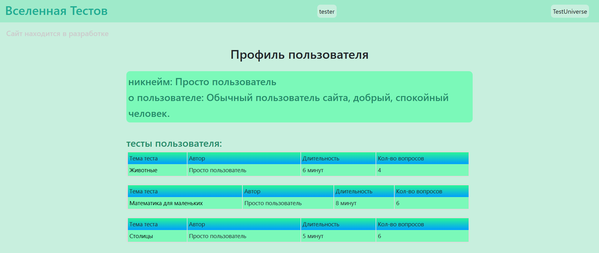
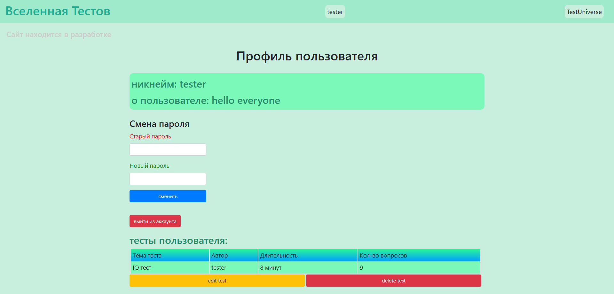

# TestUniverse

Сайт "TestUniverse" ("ВселеннаяТестов") нужен для создания тестов развлекательного,
обучающего и иного характера, а также для прохождения тестов, созданных другими пользователями.

### Как запустить локально:
1. Распакуйте архив: build.zip
2. Запустите сервер сайта: main.py
3. Перейдите по ссылке в окне запуска

### Как пользоваться:
1. При переходе на сайт вы попадаете на главную страницу 

* На эту страницу всегда можно вернуться просто нажав на название сайта в правом верхнем углу.
* Здесь выведены тесты, уже созданные пользователями.
* В верхней части страницы расположены кнопки регистрации и входа в аккаунт. Вход необходим для создания собственных тестов.
* Также на странице присутствует окно поиска, в которое можно ввести слово для поиска среди названий тестов.
* После регистрации и входа на странице появится кнопка создания теста и имя пользователя вместо кнопок регистрации. Главная страница после входа выглядит так:

2. При нажатии "Создать тест" открывается страница создания теста

* Все поля формы подписаны и довольно просты, а в поле ответов нужно ввести правильные ответы на тест в виде, например, "2 3 1", где 2 - правильный вариант ответа на первый вопрос, 3 - на второй, а 1 - на третий.
3. При нажатии на имя пользователя в ячейке "автор" в любом тесте или нажатии на свой никнейм вверху страницы, откроется профиль выбранного пользователя.

* В профиле отображается имя пользователя, описание, которое он оставил при создании, а также все тесты, созданные данным пользователем.
* Если нажать на свой никнейм, то профиль будет отличаться. В нем появится возможность смены пароля, кнопка выхода из аккаунта, а под каждым тестом будут добавлены кнопки удаления и редактирования теста. Так выглядит профиль в таком случае:

4. При нажатии на название нужного вам теста откроется страница для его решения

* Сверху указана тема теста, количество вопросов и примерная продолжительность.
* Далее идет сама форма для прохождения теста, в которой нужно выбрать ответы, кажущиеся вам правильными.
* При нажатии на кнопку завершить внизу формы, вы получите ваш результат (если баллов достаточно, надпись загорится зеленым, иначе - красным):

### В заключение
Сайт всё ещё находится в разработке, просьба отнестись с пониманием и сообщить в случае обнаружения ошибки.

## Вперёд к знаниям!
